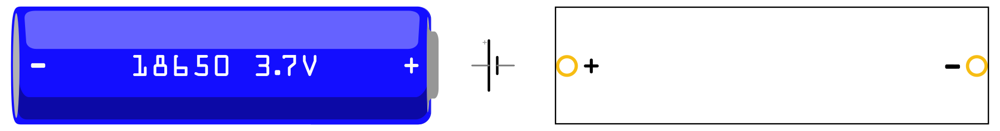

# Rechargable 3.7V 18650 Li-ion cell

A Fritzing part of a rechargable battery, 3.7V 18650 Li-ion cell, based on [the work of Dr Kristofer Chan](https://github.com/DrKrisChan/18650-Fritzing-part).

\[[Download link](18650_Rt.fzpz)\]

## LICENSE

This work is licensed under the [GNU General Public License v3.0](../LICENSE-GPLV30). All media and data files that are not source code are licensed under the [Creative Commons Attribution 4.0 BY-SA license](../LICENSE-CCBYSA40).

More information about licenses in [Opensource licenses](https://opensource.org/licenses/) and [Creative Commons licenses](https://creativecommons.org/licenses/).
