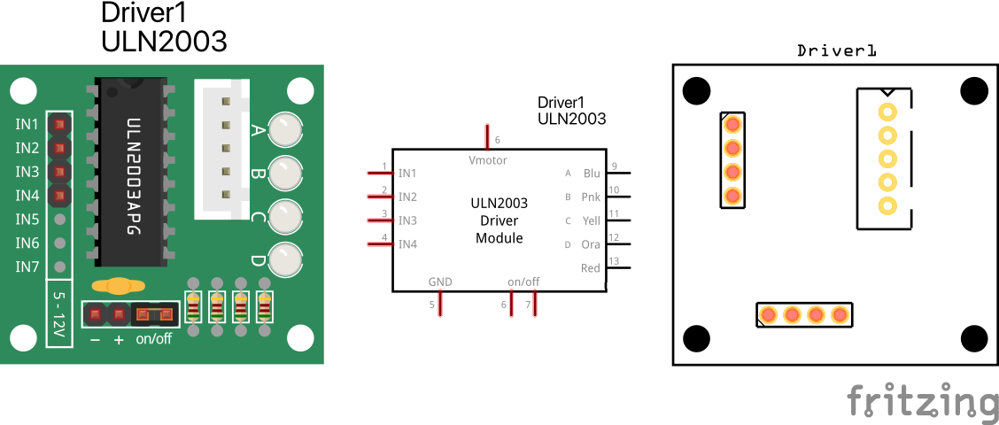

# 28BYJ-48 Driver Module ULN2003
A fritzing part for the 28BYJ-48 Driver Module ULN2003 with its JST connector and all the control and power pins. Includes also the schematic symbol and the pcb footprint.

Have a look at the [28BYJ-48 Stepper Motor part](../28BYJ-48-motor/) also.

## NOTES

* The JST connector pins are incorrectly marked as **female** on purpose, as a trick to *help* Fritzing connect the 28BYJ-48 Unipolar Stepper Motor to it more *naturally* (the same trick is applied to the motor itself).

* Used some of [the fritzing tools by @Vanepp](https://github.com/vanepp): go check them.

## LICENSE

This work is licensed under the [GNU General Public License v3.0](../LICENSE-GPLV30). All media and data files that are not source code are licensed under the [Creative Commons Attribution 4.0 BY-SA license](../LICENSE-CCBYSA40).

More information about licenses in [Opensource licenses](https://opensource.org/licenses/) and [Creative Commons licenses](https://creativecommons.org/licenses/).
