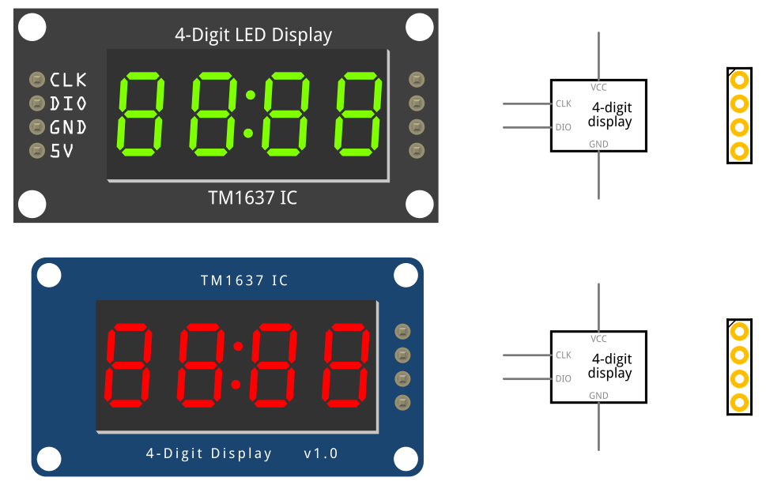

# 4-digit 7-segment LED display

Two fritzing parts of a 4-digit 7-segment LED display module driven by a TM1637 IC controller via 1-wire protocol (a simplified version of I2C protocol):

* [Robotdyn version](4-digit-display_8pingreen_Rt.fzpz) with duplicate 4-pin rows, in green color
* [HiLetgo version](4-digit-display_4pinred_Rt.fzpz) with a single 4-pin row, in red color

## LICENSE

This work is licensed under the [GNU General Public License v3.0](../LICENSE-GPLV30). All media and data files that are not source code are licensed under the [Creative Commons Attribution 4.0 BY-SA license](../LICENSE-CCBYSA40).

More information about licenses in [Opensource licenses](https://opensource.org/licenses/) and [Creative Commons licenses](https://creativecommons.org/licenses/).
