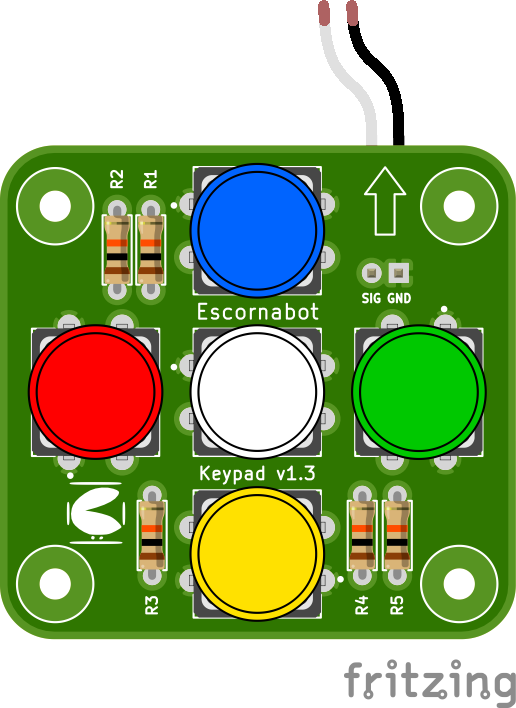

# Escornabot 5 keys Keypad
A fritzing part for the [Escornabot 5 keys Keypad](https://github.com/mgesteiro/escornakeypad) with bendable legs/connectors.

## NOTES

* Part of the [Escornabot project](https://escornabot.org).
* Fritzing part of the [original design](https://github.com/mgesteiro/escornakeypad).
* Used some of [the fritzing tools by @Vanepp](https://github.com/vanepp): go check them.

## LICENSE

This work is licensed under the [GNU General Public License v3.0](../LICENSE-GPLV30). All media and data files that are not source code are licensed under the [Creative Commons Attribution 4.0 BY-SA license](../LICENSE-CCBYSA40).

More information about licenses in [Opensource licenses](https://opensource.org/licenses/) and [Creative Commons licenses](https://creativecommons.org/licenses/).
