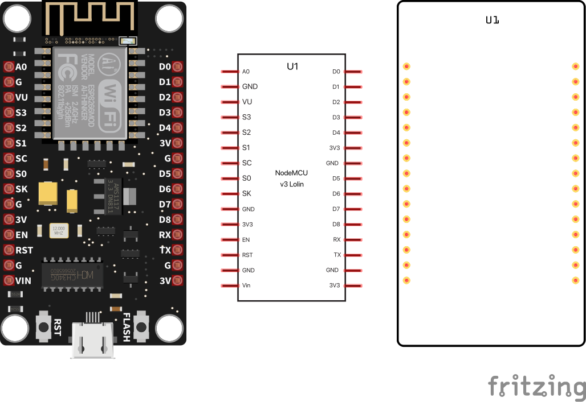

# Lolin NodeMCU v3
A fritzing part of an ESP-8266 Lolin NodeMCU v3 board, based on the [work of Achim Pieters](https://github.com/AchimPieters/Fritzing-Custom-Parts).

## LICENSE

This work is licensed under the [GNU General Public License v3.0](../LICENSE-GPLV30). All media and data files that are not source code are licensed under the [Creative Commons Attribution 4.0 BY-SA license](../LICENSE-CCBYSA40).

More information about licenses in [Opensource licenses](https://opensource.org/licenses/) and [Creative Commons licenses](https://creativecommons.org/licenses/).
