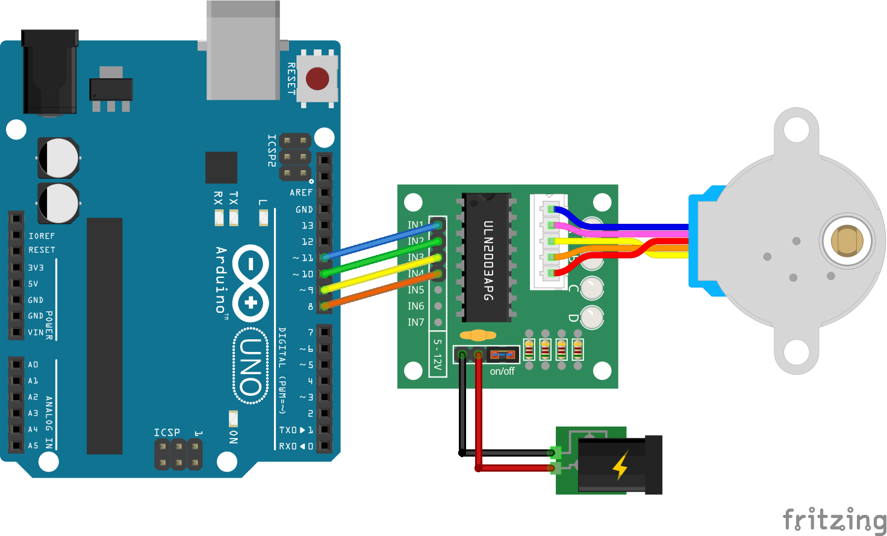

# fritzing-parts
My own Fritzing parts repository, ready to be used.

## EXAMPLE
A 28BYJ-48 Unipolar Stepper Motor with its ULN2003 Driver Module attached, mounted with an Arduino UNO.

Download [this fritzing example](28BYJ-48-driver_and_motor.fzz).

## LICENSE
This work is licensed under the [GNU General Public License v3.0](LICENSE-GPLV30). All media and data files that are not source code are licensed under the [Creative Commons Attribution 4.0 BY-SA license](LICENSE-CCBYSA40).

More information about licenses in [Opensource licenses](https://opensource.org/licenses/) and [Creative Commons licenses](https://creativecommons.org/licenses/).
