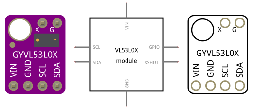

# ToF Laser Distance Sensor VL53L0X
A fritzing part of a VL53L0X ToF (time of flight) Laser Distance sensor mounted in a brekout board that operates via I2C protocol.

\[[Download link](VL53L0X_Rt.fzpz)\]

## LICENSE

This work is licensed under the [GNU General Public License v3.0](../LICENSE-GPLV30). All media and data files that are not source code are licensed under the [Creative Commons Attribution 4.0 BY-SA license](../LICENSE-CCBYSA40).

More information about licenses in [Opensource licenses](https://opensource.org/licenses/) and [Creative Commons licenses](https://creativecommons.org/licenses/).
