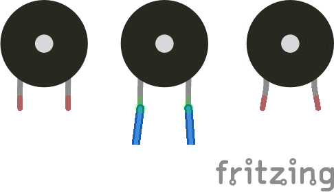

# Passive buzzer 12mm, 3-5V
A fritzing part of a passive buzzer of 12mm diameter and 3-5V, without a breakout board and with bendable legs.

## NOTES

* Used some of [the fritzing tools by @Vanepp](https://github.com/vanepp): go check them.

## LICENSE

This work is licensed under the [GNU General Public License v3.0](../LICENSE-GPLV30). All media and data files that are not source code are licensed under the [Creative Commons Attribution 4.0 BY-SA license](../LICENSE-CCBYSA40).

More information about licenses in [Opensource licenses](https://opensource.org/licenses/) and [Creative Commons licenses](https://creativecommons.org/licenses/).
