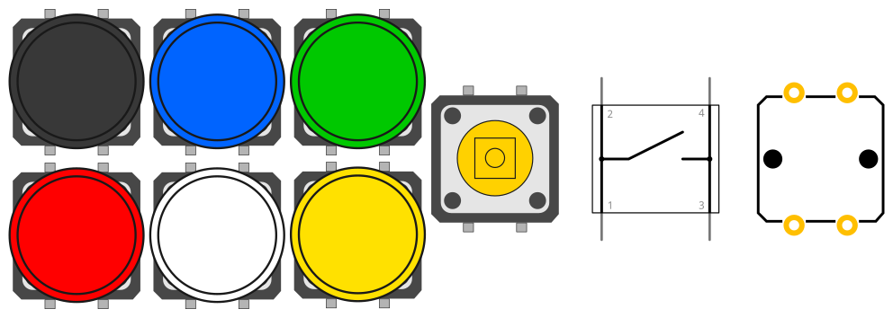

# Tactile switch 12 mm

A Fritzing part of a 12 mm tactile switch, in 7 different versions: 6 cap colors and one without. Based on the [OMRON B3F-XXXX family](https://components.omron.com/us-en/datasheet_pdf/A070-E1.pdf).

Once you install all of them in Fritzing, it's very easy to switch from one version to another using the `color` property selector in the parts tab.

## LICENSE

This work is licensed under the [GNU General Public License v3.0](../LICENSE-GPLV30). All media and data files that are not source code are licensed under the [Creative Commons Attribution 4.0 BY-SA license](../LICENSE-CCBYSA40).

More information about licenses in [Opensource licenses](https://opensource.org/licenses/) and [Creative Commons licenses](https://creativecommons.org/licenses/).
