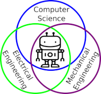
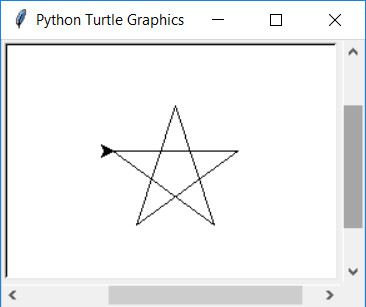
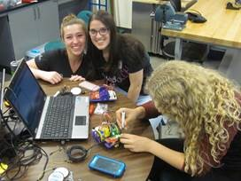

Open Source Turtle Robot (OSTR)
-------------------------------

 
 

I designed this project for a 10-hour workshop for [ChickTech.org](http://www.chicktech.org) whose goal is to introduce teenage women to STEM topics. The goals for this project were:

- Easy to build.
- Easy to program.
- Did something interesting.
- Low-cost so participants could take it home and continue to learn.

Robotics is the exciting intersection of a number of engineering fields including mechanical engineering, electrical engineering, and computer science. This project was designed to make learning about these fields accessible and exciting.

Turtle robots are controled by simple instructions like "forward(distance)" and "left(degrees)", and their visual tracks are instructive as well as entertaining. They also demonstrate how systems with simple rules can have complex behaviors, something we see in nature all the time.

 
 

Python is a popular and easy to learn programming language that already has Turle Graphics built in.  Since the robots instructions are the same, programs and paterns can be evaluated on the computer and then run on the robot.  It you have Python installed, try it!  If not, [try it online](https://repl.it/site/languages/python_turtle).
```python
from turtle import *


for x in range(5):
    forward(100)
    right(144)
```

Video of Turtle Robot in action:
[](https://www.youtube.com/watch?v=j0FpB0iv0v0)


This robot has been refined through a number workshops, but still has room for improvement.  Please share your ideas and modifications so it can continue to improve.

 


Bill Of Materials
-----------------
In bulk quantities, the cost per robot is about $40.  The Bill of Materials is available [here](BOM.md).
Having told you the at-cost and provided you my BOM, I'd still offer to [sell you a kit](/V2/BOM.md) if you'd like to pay for the convenice of a single-source or you don't have access to a 3D printer.  This also allows me continue development for future workshops.


Design Files
------------
The electronics were designed using Open Source [KiCad](http://kicad-pcb.org/). Design files are located in the [design_files](design_files/) folder.  You can oogle the [schematic](docs/Schematic.pdf).

The 3D Design files are located in the [3D](3D/) folder.

Firmware
--------
This project is programed using the Open Source [Arduino](https://www.arduino.cc/). The firmware is located in the [firmware](firmware/) folder.  Instructions for setting up the Arduino enviroment for the Adafruit Trinket Pro are at [https://learn.adafruit.com/introducing-pro-trinket](https://learn.adafruit.com/introducing-pro-trinket).

Assembly Instructions
---------------------
Located in the [docs](docs/) folder.

License
-------
[Attribution-ShareAlike 3.0 United States (CC BY-SA 3.0 US)](https://creativecommons.org/licenses/by-sa/3.0/us/)

You are free to:

- Share — copy and redistribute the material in any medium or format
- Adapt — remix, transform, and build upon the material

Under the following terms:

- Attribution — You must give appropriate credit, provide a link to the license, and indicate if changes were made. You may do so in any reasonable manner, but not in any way that suggests the licensor endorses you or your use.
- ShareAlike — If you remix, transform, or build upon the material, you must distribute your contributions under the same license as the original.

Certified Open Source:
----------------------
This project as been certified by the [Open Source Hardward Association](https://certification.oshwa.org/):

![OSHWA](V2/image/OSHWA.png